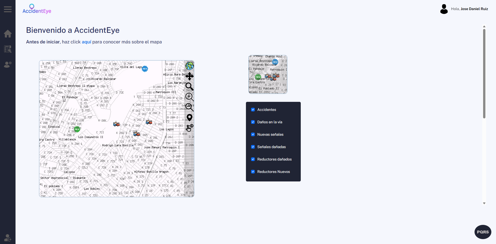
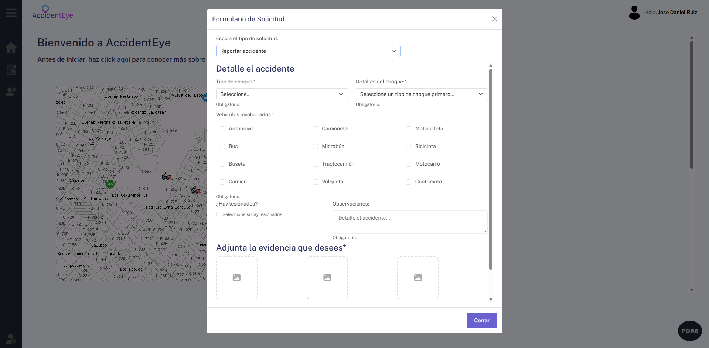

# AccidentEye

Geovisor web de accidentalidad vial para la ciudad de Cali. Permite reportar y consultar accidentes, daños en la vía, reductores de velocidad y señales de tránsito sobre un mapa interactivo.

## Tecnologías

- **Backend:** PHP 5.2, arquitectura MVC
- **Base de datos:** PostgreSQL 9.2 + PostGIS
- **Servidor y mapas:** MS4W (Apache + MapServer)
- **Frontend:** jQuery, AJAX, Bootstrap, Chart.js, SweetAlert2, FontAwesome
- **Librerías:** PHPMailer 5.2.28, PHPExcel 1.8

> El proyecto se desarrolló sobre este entorno (PHP 5.2 y PostgreSQL 9.2), por lo que requiere versiones antiguas para ejecutarse.

## Arquitectura

Sigue el patrón MVC:

- **Modelo:** conexión y consultas a PostgreSQL/PostGIS
- **Vista:** interfaces con Bootstrap y jQuery, y gráficos con Chart.js
- **Controlador:** lógica de la aplicación en PHP

## Estructura del proyecto

| Directorio | Descripción |
|---|---|
| `Controlador/` | Clases de los controladores |
| `Modelo/` | `MasterModel.php` y los modelos que lo extienden |
| `Vista/` | Vistas de la aplicación |
| `Web/` | Punto de entrada (`index.php`, `login.php`) y recursos |
| `Web/Cali.map` | Configuración de capas de MapServer |
| `Web/shape/` | Capas del mapa de Cali |
| `lib/conf/` | Conexión a la base de datos |

## Requisitos

- Windows
- MS4W
- PHP 5.2
- PostgreSQL 9.2 con PostGIS
- Navegador: Chrome, Edge u Opera GX

## Instalación

1. Instala **MS4W** y elige un puerto libre.
2. Instala **PostgreSQL 9.2** con **PostGIS** y crea la base de datos `proyecto_final` usando la plantilla de PostGIS.
3. Importa el script de la base de datos con `psql` y ejecuta los scripts de PostGIS en `share\contrib\postgis-2.0`.
4. Copia **PHPMailer 5.2.28** y **PHPExcel 1.8** en la carpeta `Web/` y activa en `php.ini` las extensiones `openssl`, `php_sockets` y `php_zip`.
5. Clona el repositorio dentro de `C:\ms4w\Apache\htdocs`.
6. Configura las credenciales de la base de datos en `lib/conf/conf.php`.
7. Abre `http://localhost:8080/proyecto_final/web/login.php`.

La guía completa, con capturas, está en [docs/Manual_Tecnico.docx](docs/Manual_Tecnico.docx).

## Capturas

## Autor

José Daniel Ruiz · [LinkedIn](https://www.linkedin.com/in/jose-daniel-ruiz/)
